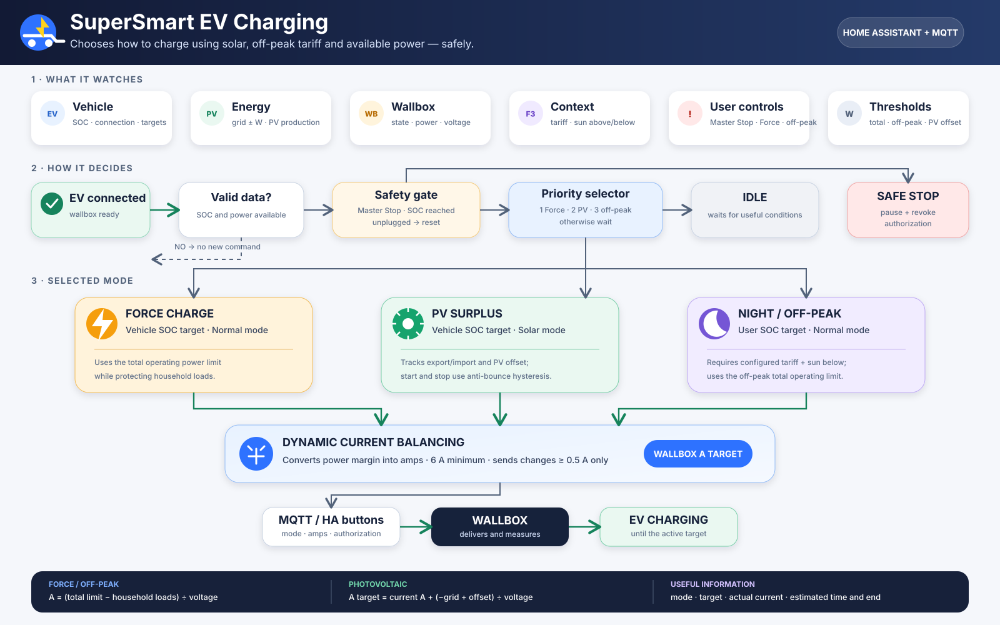

# SuperSmart EV Charging for Home Assistant

[](https://www.hacs.xyz/)
[](https://www.home-assistant.io/)
[](custom_components/supersmart_ev_charging/manifest.json)

[🇮🇹 Italiano](README.md) · 🇬🇧 English

A HACS integration that replaces the original `EV - ...` automations for a
Skoda Elroq/Enyaq and Silla Prism with one configurable charging controller.

Version 0.9.0-beta.5 provides:

- all entity names translated into the Home Assistant backend language when first created;
- configurable usable battery capacity, also exposed as a number entity;
- classification as a Home Assistant service, with setup listed under Integrations;
- priority order `Master Stop → absolute SOC → FORCE → PV surplus → night F3 → idle`;
- incremental PV control with a 7 A/30 s start threshold and 5.5 A/60 s stop threshold;
- dynamic load balancing and 0.5 A anti-spam: 25 A maximum for PV, 32 A for FORCE/night;
- soft stop with a second check after 20 seconds in FORCE and F3 modes;
- intelligent exit from FORCE mode;
- separate user and vehicle SOC targets with `user ≤ vehicle` protection;
- correct active target: vehicle target for FORCE/PV, user target for night F3;
- bidirectional synchronization with the vehicle charge-limit entity;
- reset of Master Stop, FORCE and PV control when the vehicle is unplugged;
- Silla Prism MQTT energy telemetry and optional notifications.

> Do not run this integration and the old EV automations at the same time. They
> would send competing commands to the same wallbox.

## Requirements

- Home Assistant with MQTT configured;
- HACS for custom-repository installation;
- a wallbox exposing state, power and commands equivalent to Silla Prism;
- a vehicle SOC sensor.

## Compatibility

The integration was designed around **Skoda Elroq/Enyaq + Silla Prism**, but can
work with other vehicles and wallboxes exposing equivalent Home Assistant entities.

- Grid power must be positive while importing and negative while exporting.
- Wallbox state must use `idle`, `waiting`, `pause` and `charging`.
- MQTT topics and payloads are configurable during setup.
- Authorization and revocation can use Home Assistant button entities or MQTT.

## Required entities

| Role | Requirement | Example |
|---|---|---|
| Vehicle SOC | numeric percentage | `sensor.elroq_percentuale_batteria` |
| Wallbox state | `idle`, `waiting`, `pause`, `charging` | `sensor.silla_prism_stato_wallbox` |
| Wallbox power | W; sign is ignored | `sensor.wallbox_potenza` |
| Grid power | W; **positive import**, **negative export** | `sensor.rete_power` |
| PV production | W | `sensor.fotovoltaico_power` |
| Tariff band | required only when F3 charging is enabled | `sensor.pun_fascia_corrente` |

When a critical input is `unknown` or `unavailable`, the controller sends no new
commands. This is an additional safety measure compared with the original YAML.

## Optional entities

| Role | Behavior when omitted |
|---|---|
| Vehicle connection | derived from wallbox state: `idle` means unplugged |
| Wallbox voltage | defaults to 230 V and is internally clamped to 180–260 V |
| Total instantaneous power | calculated as `grid power + PV production` |
| Vehicle charge limit | internal vehicle-target number remains available, without synchronization |
| Wallbox port mode | only improves PV notification classification |
| Authorize/revoke buttons | configured generic MQTT topics are used instead |
| Notification service | no notifications; example: `notify.mobile_app_family` |

## Helpers to create

None. The integration creates entities replacing the original helpers:

| Old helper | Integration entity |
|---|---|
| `input_boolean.ev_master_stop` | **Master Stop** switch |
| `input_boolean.forza_ricarica` | **Force Charge** switch |
| `input_boolean.ev_solar_controller_active` | **Solar Controller Active** switch |
| `input_number.limite_batteria_manuale` | **User SOC Target** number |
| `input_number.limite_batteria_auto` | **Vehicle SOC Target** number |
| `input_number.limite_import_permesso` | **Allowed Grid Import** number |
| `input_number.limite_potenza_contratto_w` | **Contract Power** number |
| `input_number.ev_limite_notturno_w` | **Night Power Limit** number |
| `input_number.ev_capacita_batteria_kwh` | **Usable Battery Capacity** number |
| `input_number.wallbox_last_limit_sent` | internal controller state |
| authorization/revocation datetimes | internal timestamps |
| charging-mode input select | **Charging Mode** sensor |

## HACS installation

1. Publish this repository on GitHub.
2. Open **HACS → Integrations → Custom repositories**.
3. Enter the repository URL and select **Integration**.
4. Install it and restart Home Assistant.
5. Disable the old EV automations.
6. Go to **Settings → Devices & services → Add integration** and search for
   **SuperSmart EV Charging**.

Battery capacity and feature flags can later be changed through **Configure**.
Usable capacity can also be adjusted directly from the integration's number
entity to support different EVs and capacity degradation over time. Power limits
and SOC targets are adjusted through the other number entities. To change source
entities, remove and add the integration again.

## Silla Prism defaults

| Function | Default topic/payload |
|---|---|
| Current limit | `prism/1/command/set_current_limit` |
| Charging mode | `prism/1/command/set_mode` |
| Solar / normal / pause | `1` / `2` / `3` |
| Grid power telemetry | `prism/energy_data/power_grid` |
| PV power telemetry | `prism/energy_data/power_solar` |
| Instantaneous power telemetry | `prism/energy_data/power_house` |

For Silla Prism, selecting the Home Assistant authorize and revoke buttons is
recommended. Generic authorize/revoke MQTT topics are a fallback for other wallboxes.

## PV current calculation

While charging, the new current target is not just the instantaneous grid surplus:

```text
delta_A       = (-grid_power + allowed_import) / voltage
current_now   = wallbox_power / voltage
target_A      = current_now + delta_A
```

Using only `delta_A` would incorrectly treat a stable near-zero-grid-exchange
charge as if there were no PV power available.

## Decision priority

```text
vehicle unplugged → full reset
        ↓
Master Stop → mode 3 + revoke authorization
        ↓
SOC ≥ vehicle target → mode 3 + revoke authorization
        ↓
FORCE → mode 2, vehicle target, contract load balancing
        ↓
PV surplus → mode 1, vehicle target, 7 A / 5.5 A hysteresis
        ↓
F3 + night → mode 2, user target, night power limit
        ↓
idle
```

The controller reacts to state changes and also evaluates conditions every 30
seconds. Decisions are serialized to avoid overlapping MQTT publications.

## Created entities

- Sensors: charging mode, PV surplus, active SOC target, remaining time,
  estimated completion time and wallbox target current.
- Switches: Master Stop, Force Charge, Solar Controller and Night/F3 Charging.
- Numbers: user/vehicle SOC targets, usable battery capacity, contract power,
  allowed grid import and night charging power limit.

The estimate uses `((target SOC - SOC) / 100 × usable capacity kWh) / wallbox
power kW`. Power is instantaneous and charging efficiency is assumed to be
100%; below 100 W, remaining time and estimated completion are unavailable.

Home Assistant assigns entity IDs according to the device name and language.
Check the actual IDs under **Settings → Devices & services → Entities**.

## Example Lovelace card

Replace the following entity IDs with those assigned by your Home Assistant instance.

```yaml
type: entities
title: SuperSmart EV Charging
entities:
  - entity: sensor.supersmart_ev_charging_charging_mode
  - entity: sensor.supersmart_ev_charging_pv_surplus
  - entity: sensor.supersmart_ev_charging_charging_time_remaining
  - entity: number.supersmart_ev_charging_user_soc_target
  - entity: number.supersmart_ev_charging_vehicle_soc_target
  - entity: number.supersmart_ev_charging_usable_battery_capacity
  - entity: switch.supersmart_ev_charging_master_stop
  - entity: switch.supersmart_ev_charging_force_charge
  - entity: switch.supersmart_ev_charging_night_off_peak_charging
  - entity: number.supersmart_ev_charging_allowed_grid_import_offset
  - entity: number.supersmart_ev_charging_contract_power_limit
```

## Available actions

```yaml
action: supersmart_ev_charging.authorize_charging
```

```yaml
action: supersmart_ev_charging.revoke_charging
```

```yaml
action: supersmart_ev_charging.set_charge_limit
data:
  current_a: 10
```

## Flow diagram



## Repository structure

```text
custom_components/supersmart_ev_charging/
├── __init__.py          # Home Assistant setup, actions and events
├── calculations.py     # Testable electrical calculations
├── coordinator.py      # Priorities, balancing and MQTT commands
├── config_flow.py      # Guided setup and options
├── const.py            # Constants and default values
├── number.py           # Adjustable SOC targets and limits
├── sensor.py           # Diagnostic sensors and estimates
├── switch.py           # Master Stop, FORCE, PV and F3 switches
├── services.yaml       # Action descriptions
├── manifest.json       # Home Assistant/HACS metadata
├── strings.json        # Base UI strings
└── translations/
    ├── it.json
    └── en.json
```

## Migrating from YAML automations

1. Record the current values of the old helpers.
2. Disable the old EV automations before enabling the integration.
3. Install and configure SuperSmart EV Charging.
4. Copy the SOC targets, contract power, allowed import and night limit into the
   new number entities.
5. Perform a controlled charging test.
6. Disable and, only after testing, delete the old helpers.

Disabled helpers remain in the Home Assistant registry, but they do not conflict
with the new entities because they use different domains (`input_boolean` versus
`switch`, and `input_number` versus `number`).

## Credits

Based on the Home Assistant EV energy-management automations and the original
`ha-skoda-elroq-smart-charging` project logic.

## License

MIT License — see [LICENSE](LICENSE).
