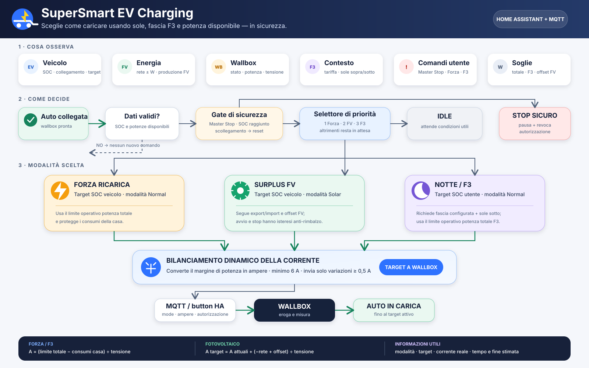

# SuperSmart EV Charging per Home Assistant

[](https://www.hacs.xyz/)
[](https://www.home-assistant.io/)
[](custom_components/supersmart_ev_charging/manifest.json)

🇮🇹 Italiano · [🇬🇧 English](README.en.md)

Integrazione HACS che riunisce le automazioni `EV - ...` per Skoda Elroq/Enyaq
e Silla Prism in un solo controller configurabile.

La versione 0.9.0-beta.2 include:

- priorità `Master Stop → SOC assoluto → FORZA → surplus FV → notte F3 → idle`;
- FV incrementale con avvio a 7 A per 30 s e stop sotto 5,5 A per 60 s;
- bilanciamento carichi e anti-spam 0,5 A: massimo 25 A in FV e 32 A in FORZA/notte;
- soft-stop con verifica dopo 20 s in FORZA e in F3;
- uscita intelligente da FORZA;
- due target SOC con protezione `utente ≤ veicolo`;
- target attivo corretto: veicolo in FORZA/FV, utente in notte F3;
- sincronizzazione bidirezionale con il limite SOC dell'auto;
- reset di Master Stop, FORZA e FV allo scollegamento;
- telemetria MQTT Prism e notifiche opzionali.

> Non lasciare attive insieme questa integrazione e le vecchie automazioni:
> invierebbero comandi concorrenti alla stessa wallbox.

## Requisiti

- Home Assistant con MQTT configurato;
- HACS per l'installazione come repository personalizzato;
- wallbox con stato, potenza e comandi equivalenti a Silla Prism;
- veicolo con sensore SOC.

## Compatibilità

L'integrazione nasce dalla configurazione **Skoda Elroq/Enyaq + Silla Prism**, ma
può essere utilizzata con altri veicoli e wallbox se espongono in Home Assistant
gli stessi tipi di sensore e comandi MQTT.

- Il segno della potenza di rete deve essere positivo in import e negativo in export.
- Lo stato della wallbox deve usare `idle`, `waiting`, `pause` e `charging`.
- I payload e i topic MQTT sono configurabili durante l'installazione.
- Autorizzazione e revoca possono usare button Home Assistant oppure topic MQTT.

## Sensori ed entità da configurare

### Obbligatori

| Ruolo | Requisito | Esempio |
|---|---|---|
| SOC veicolo | percentuale numerica | `sensor.elroq_percentuale_batteria` |
| Stato wallbox | `idle`, `waiting`, `pause`, `charging` | `sensor.silla_prism_stato_wallbox` |
| Potenza wallbox | W, il segno viene ignorato | `sensor.wallbox_potenza` |
| Potenza rete | W; **positivo import**, **negativo export** | `sensor.rete_power` |
| Produzione FV | W | `sensor.fotovoltaico_power` |
| Fascia tariffaria | obbligatoria solo se F3 è abilitata | `sensor.pun_fascia_corrente` |

Se un ingresso critico è `unknown` o `unavailable`, il controller non invia
nuovi comandi: è una protezione aggiuntiva rispetto ai template YAML.

### Opzionali

| Ruolo | Comportamento se omesso |
|---|---|
| Connessione veicolo | derivata dallo stato wallbox: `idle` = scollegato |
| Tensione wallbox | fallback 230 V, limitato internamente a 180–260 V |
| Potenza istantanea totale | `potenza_rete + produzione_FV`, come il template esistente |
| Limite di carica veicolo | nessuna sincronizzazione; resta il number interno |
| Modo porta wallbox | usato solo per classificare le notifiche FV |
| Button autorizza/revoca | fallback ai topic MQTT generici configurati |
| Servizio notifiche | nessuna notifica; esempio `notify.mobile_app_famiglia` |

## Helper da creare

Nessuno. L'integrazione crea le entità che sostituiscono gli helper:

| Vecchio helper | Entità dell'integrazione |
|---|---|
| `input_boolean.ev_master_stop` | switch **Master Stop** |
| `input_boolean.forza_ricarica` | switch **Forza Ricarica** |
| `input_boolean.ev_solar_controller_active` | switch **Controller Solare Attivo** |
| `input_number.limite_batteria_manuale` | number **Target SOC utente** |
| `input_number.limite_batteria_auto` | number **Target SOC veicolo** |
| `input_number.limite_import_permesso` | number **Import rete permesso** |
| `input_number.limite_potenza_contratto_w` | number **Potenza contrattuale** |
| `input_number.ev_limite_notturno_w` | number **Limite potenza notturna F3** |
| `input_number.wallbox_last_limit_sent` | stato interno |
| `input_datetime.ev_last_auth_press` | timestamp interno |
| `input_datetime.ev_last_revoke_press` | timestamp interno |
| `input_select.ev_modalita_ricarica_corrente` | sensore **Modalità ricarica** |

## Installazione HACS

1. Pubblicare questo repository su GitHub.
2. In HACS aprire **Integrazioni → Repository personalizzati**.
3. Inserire l'URL e scegliere **Integrazione**.
4. Installare e riavviare Home Assistant.
5. Disattivare le vecchie automazioni EV.
6. In **Impostazioni → Dispositivi e servizi** aggiungere
   **SuperSmart EV Charging**.

Capacità batteria e flag di funzione si cambiano con **Configura**. Potenza e
target SOC si regolano direttamente dalle entità number create dall'integrazione.
Per cambiare le entità sorgente, rimuovere e aggiungere di nuovo l'integrazione.

## Configurazione Silla Prism

| Funzione | Topic/payload predefinito |
|---|---|
| Corrente | `prism/1/command/set_current_limit` |
| Modalità | `prism/1/command/set_mode` |
| Solare / normale / pausa | `1` / `2` / `3` |
| Potenza rete | `prism/energy_data/power_grid` |
| Potenza FV | `prism/energy_data/power_solar` |
| Potenza istantanea | `prism/energy_data/power_house` |

Per Prism è consigliato selezionare i button Home Assistant di autorizzazione
e revoca. I topic authorize/revoke sono il fallback per altre wallbox.

## Calcolo FV

Durante una ricarica il nuovo target non è il solo surplus di rete:

```text
delta_A      = (-potenza_rete + import_permesso) / tensione
corrente_ora = potenza_wallbox / tensione
target_A     = corrente_ora + delta_A
```

Usando soltanto `delta_A`, una carica stabile vicino allo zero-scambio verrebbe
erroneamente interpretata come priva di surplus.

## Priorità

```text
veicolo scollegato → reset completo
        ↓
Master Stop → mode 3 + revoca
        ↓
SOC ≥ target veicolo → mode 3 + revoca
        ↓
FORZA → mode 2, target veicolo, bilanciamento contratto
        ↓
surplus FV → mode 1, target veicolo, isteresi 7 A / 5,5 A
        ↓
F3 + notte → mode 2, target utente, limite potenza notturna
        ↓
idle
```

Il controller reagisce ai cambi di stato e verifica comunque ogni 30 secondi.
Le decisioni sono serializzate per evitare publish sovrapposti.

## Entità create

- Sensori: modalità, surplus FV, target SOC, tempo residuo, fine stimata,
  corrente target.
- Switch: Master Stop, Forza Ricarica, Controller Solare, Notte F3.
- Number: target SOC utente/veicolo, potenza contrattuale, import permesso,
  limite potenza notturna.

Gli entity ID vengono assegnati da Home Assistant in base al nome del dispositivo
e alla lingua. I nomi visualizzati sopra sono quindi descrittivi: verificare gli
ID effettivi in **Impostazioni → Dispositivi e servizi → Entità**.

## Esempio di card Lovelace

Sostituire gli entity ID dell'esempio con quelli assegnati dalla propria istanza.

```yaml
type: entities
title: SuperSmart EV Charging
entities:
  - entity: sensor.supersmart_ev_charging_charging_mode
  - entity: sensor.supersmart_ev_charging_pv_surplus
  - entity: sensor.supersmart_ev_charging_charging_time_remaining
  - entity: number.supersmart_ev_charging_user_soc_target
  - entity: number.supersmart_ev_charging_vehicle_soc_target
  - entity: switch.supersmart_ev_charging_master_stop
  - entity: switch.supersmart_ev_charging_force_charge
  - entity: switch.supersmart_ev_charging_night_off_peak_charging
  - entity: number.supersmart_ev_charging_allowed_grid_import_offset
  - entity: number.supersmart_ev_charging_contract_power_limit
```

## Azioni

```yaml
action: supersmart_ev_charging.authorize_charging
```

```yaml
action: supersmart_ev_charging.revoke_charging
```

```yaml
action: supersmart_ev_charging.set_charge_limit
data:
  current_a: 10
```

## Verifica consigliata

In **Strumenti per sviluppatori → Stati** controllare unità e segno della rete.
Le automazioni originarie usano conversioni Jinja `float(0)`; l'integrazione
applica conversioni equivalenti, ma blocca i comandi se un ingresso critico manca.

## Diagramma



## Struttura del repository

```text
custom_components/supersmart_ev_charging/
├── __init__.py          # Setup, azioni ed eventi Home Assistant
├── calculations.py     # Calcoli elettrici testabili
├── coordinator.py      # Priorità, bilanciamento e comandi MQTT
├── config_flow.py      # Configurazione guidata e opzioni
├── const.py            # Costanti e valori predefiniti
├── number.py           # Target SOC e limiti regolabili
├── sensor.py           # Sensori diagnostici e stime
├── switch.py           # Master Stop, FORZA, FV e F3
├── services.yaml       # Descrizione delle azioni
├── manifest.json       # Metadati Home Assistant/HACS
├── strings.json        # Stringhe UI di base
└── translations/
    ├── it.json
    └── en.json
```

## Migrazione dalle automazioni YAML

1. Annotare i valori dei vecchi helper.
2. Disattivare le vecchie automazioni EV prima di attivare l'integrazione.
3. Installare e configurare SuperSmart EV Charging.
4. Riportare target SOC, potenza contrattuale, import permesso e limite notturno
   nelle nuove entità number.
5. Eseguire un collaudo controllato.
6. Disabilitare e, solo dopo il collaudo, eliminare i vecchi helper.

Gli helper disabilitati restano nel registro di Home Assistant, ma non entrano in
conflitto con le nuove entità perché usano domini diversi (`input_boolean` contro
`switch`, `input_number` contro `number`).

## Crediti

Basato sul set di automazioni Home Assistant per la gestione energetica EV e
sulla logica originale del progetto `ha-skoda-elroq-smart-charging`.

## Licenza

MIT, vedere `LICENSE`.
